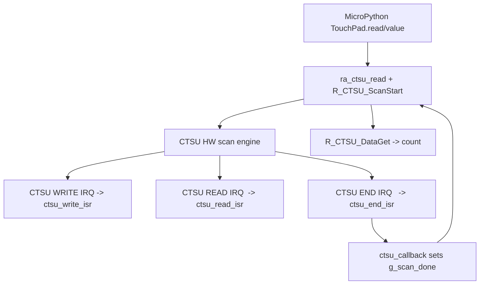
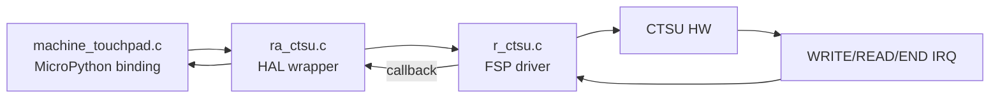
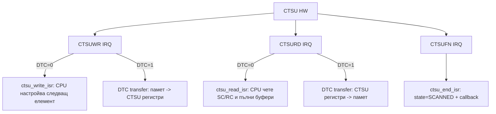

## CTSU на RA4M2 в MicroPython (renesas-ra): thread + задълбочен анализ (с диаграми)

Дата: 2026-02-15

---

### 1) Thread (препис на разговора)

#### 1.1 Първоначален въпрос

**User:** анализирай в ra4m2 как е реализиран CTSU подръжка , ползва ли се прекъсване?

**Assistant:** CTSU в `ports/renesas-ra` се ползва като backend за `machine.TouchPad` и е реализирана като:

- MicroPython binding: `machine_touchpad.c` (вика `ra_ctsu_*`, не вика директно `R_CTSU_*`)
- HAL wrapper: `ra/ra_ctsu.c` (обвивка около FSP `r_ctsu`)
- FSP драйвер: `lib/fsp/ra/fsp/src/r_ctsu/r_ctsu.c` (реална имплементация + ISR-и)

CTSU кодът се включва в build-а само ако е включен touchpad (`MICROPY_HW_ENABLE_TOUCHPAD=1`).

Отговор на въпроса за прекъсванията: Да, CTSU разчита на IRQ. При RA4M2 се ползват 3 прекъсвания (WRITE / READ / END). От гледна точка на MicroPython wrapper-а изглежда като polling (чакане), но реалното приключване става чрез IRQ->ISR->callback.

#### 1.2 Искане за задълбочаване

**User:** моля задълбочен анализ без въпроси!

**Assistant:** даден е задълбочен анализ (виж секция 2 по-долу), включващ:

- архитектурата на слоевете (binding -> wrapper -> FSP)
- RA4M2 pin/channel mapping в `ra_ctsu.c`
- трите CTSU IRQ (WRITE/READ/END) и ролята им
- защо wrapper-ът е „polling“, но реално чака interrupt-driven callback
- Mermaid диаграма на data/IRQ потока

#### 1.3 Искане „в MD файл“

**User:** СЛОЖИ ВСИКИ ОБЯСНЕНИЯ И КАРТИНКАТА В MD FILE

**Assistant:** съдържанието е оформено в Markdown файл (този документ) и съдържа и диаграма.

#### 1.4 Искане „всичко от чата“

**User:** ВСИЧКО КОЕТО СИ ОТГОВОРИЛ В ЧАТА ГО СЛОЖИ В md ФАЙЛ!

**Assistant:** този документ съдържа (1) препис на разговора и (2) пълния анализ с диаграми.

#### 1.5 Допълнителни реплики

**User:** АНАЛИЗИРАЙ ЗАДЪЛБОЧЕНО ... ЦЕЛИЯ ОТГОВОР И ДИАГРАМИТЕ В ФАЙЛ.

**Assistant:** прегледани са конкретни файлове за точни цитати и е подготвен Markdown документ.

**User:** МОЖЕШ ЛИ ДА ЧЕТЕШ КОНТЕКСТА ОТ ЧАТА ПО ГОРЕ?

**Assistant:** 

- Да, виждам контекста, който е в текущия чат прозорец (съобщенията ти, моите отговори, и резултатите от инструментите тук).
- Виждам и “summary” блока, който е включен от supervisor-а (това е компресиран преглед на предишните стъпки).
- Не мога да “отварям” или “чета” нещо, което не е показано/предадено в този чат, освен ако не е включено като текст тук или не го извлека от файловете в workspace.

**User:** ПРОЧЕТИ ТОЗИ ТРЕАД И ГО СЛОЖИ В md !

**Assistant:** този файл е резултатът: thread + анализ + диаграми.

#### 1.6 Междинни потвърждения (буквални)

**User:** моля задълбочен анализ без въпроси!

**Assistant:** OK.

---

### 2) Задълбочен анализ: как е реализирана CTSU поддръжката за RA4M2 и ползва ли прекъсвания

CTSU (Capacitive Touch Sensing Unit) в този порт е реализиран като **синхронен API (polling) върху прекъсванията на FSP CTSU драйвера**.

От гледна точка на MicroPython извикването е блокиращо (чака сканът да свърши), но реалното „движение“ на скана и „събуждането“ става чрез **3 хардуерни IRQ**: WRITE / READ / END.

Ключов извод (директен отговор на въпроса): CTSU на RA4M2 **ползва прекъсвания задължително**; wrapper-ът просто чака флаг, който се вдига в callback, извикан от ISR.

---

#### 2.1 Кога CTSU се компилира (build gating)

В `ports/renesas-ra/Makefile` CTSU се включва само при `MICROPY_HW_ENABLE_TOUCHPAD=1`:

```make
# CTSU (Capacitive Touch Sensing Unit) support
ifeq ($(MICROPY_HW_ENABLE_TOUCHPAD),1)
CFLAGS += -DMICROPY_HW_ENABLE_TOUCHPAD=1
SRC_C += machine_touchpad.c
HAL_SRC_C += $(HAL_DIR)/ra/fsp/src/r_ctsu/r_ctsu.c
HAL_SRC_C += $(addprefix ra/,ra_ctsu.c)
endif
```

Извод: CTSU поддръжката не е само „конфиг“ – реално се линква FSP драйверът `r_ctsu.c`.

Важно: векторната таблица на борда съдържа **weak ISR stubs**, за да може build-ът да минава и когато CTSU не е линкнат. Когато `r_ctsu.c` е включен, той дава “strong” дефиниции на ISR-ите и override-ва weak stub-овете.

---

#### 2.2 Архитектура на слоевете

1) MicroPython binding: `ports/renesas-ra/machine_touchpad.c`

- реализира `machine.TouchPad`
- вика wrapper функции (`ra_ctsu_*`)

2) HAL wrapper: `ports/renesas-ra/ra/ra_ctsu.c`

- подготвя пиновете/каналите
- подава IRQ номерата
- регистрира callback
- стартира scan и чака флаг (polling) до timeout

3) FSP driver: `lib/fsp/.../r_ctsu.c`

- реалната CTSU state machine
- дефинира ISR-и за CTSU WRITE/READ/END
- enable-ва IRQ-тата при `R_CTSU_Open()`

4) Board vectors: `ports/renesas-ra/boards/VK_RA4M2/ra_gen/vector_data.c`

- добавя `ctsu_write_isr / ctsu_read_isr / ctsu_end_isr` във vector table
- дава weak stub-ове (override-ват се от FSP, когато CTSU е линкнат)

---

#### 2.3 RA4M2-специфично поведение в `ra_ctsu.c`

За RA4M2 wrapper-ът е консервативен и активира минимален набор TS канали:

- TSCAP: P207
- активни TS канали: `{1, 2}`
- TS01 -> P205, TS02 -> P206
- останалите TS записи са invalid (за да не се сканират не-рутирани/невалидни канали)

Настройки:

- режим: `CTSU_MODE_SELF_MULTI_SCAN` (self-cap)
- software trigger: `CTSU_CAP_SOFTWARE`
- важен параметър за стабилност: `num_moving_average = 1` (за да не се „заклини“ `R_CTSU_DataGet()` във `FSP_ERR_CTSU_INCOMPLETE_TUNING (6002)`)

Drive clock (SDPA) за RA4M2:

- В `ra/ra_ctsu.c` има коментар/формула за CTSU1 drive clock.
- За RA4M2 се използва `sdpa = 24`, което при PCLKB=25 MHz и `CTSU_CFG_PCLK_DIVISION=0` дава:
  - divisor = `2 * (sdpa + 1)` = 50
  - `f_drive = 25 MHz / 50 = 0.5 MHz`

IRQ конфигурация (в `ra/ra_ctsu.c`):

```c
g_ctsu_cfg.write_irq = VECTOR_NUMBER_CTSU_WRITE;
g_ctsu_cfg.read_irq  = VECTOR_NUMBER_CTSU_READ;
g_ctsu_cfg.end_irq   = VECTOR_NUMBER_CTSU_END;
g_ctsu_cfg.p_callback = ctsu_callback;
g_ctsu_cfg.p_context  = &g_ctsu_cb_context;
```

---

#### 2.4 Ползва ли CTSU прекъсвания? Да – задължително (WRITE/READ/END)

В `boards/VK_RA4M2/ra_gen/vector_data.c` има записи във векторната таблица:

```c
[20] = ctsu_write_isr, /* CTSU WRITE */
[21] = ctsu_read_isr,  /* CTSU READ  */
[22] = ctsu_end_isr,   /* CTSU END   */
```

Същият файл дефинира weak stubs (за да може билдът да мине и без CTSU), които се override-ват от strong ISR дефинициите във FSP драйвера, когато `r_ctsu.c` се линкне.

Пример за weak stubs (идеята е една и съща на RA4M2 и на други бордове):

```c
BSP_WEAK_REFERENCE void ctsu_write_isr(void) { }
BSP_WEAK_REFERENCE void ctsu_read_isr(void)  { }
BSP_WEAK_REFERENCE void ctsu_end_isr(void)   { }
```

---

#### 2.5 Какво правят 3-те CTSU ISR-а (защо не е само „END interrupt“)

Това е същественото за въпроса „ползва ли се прекъсване“:

1) `ctsu_write_isr` (WRITE) – подготвя/зарежда настройки за следващ елемент

2) `ctsu_read_isr` (READ) – чете измерването (SC/RC). В FSP има изричен коментар, че RC трябва да се прочете; иначе сканът може да „увисне“.

3) `ctsu_end_isr` (END) – маркира „scan complete“ и вика callback-а (ако е зададен).

Забележка: при `CTSU_CFG_DTC_SUPPORT_ENABLE = 0` (както е тук) целият „data-move“ път е CPU/ISR-базиран (без DTC), т.е. READ/WRITE IRQ-ата не са „опционални“.

---

#### 2.6.1 FSP enable-ва и трите IRQ в `R_CTSU_Open()`

В `lib/fsp/ra/fsp/src/r_ctsu/r_ctsu.c` (FSP CTSU драйвер) IRQ-тата се enable-ват през BSP:

```c
R_BSP_IrqCfgEnable(p_cfg->write_irq, CTSU_CFG_INT_PRIORITY_LEVEL, p_instance_ctrl);
R_BSP_IrqCfgEnable(p_cfg->read_irq,  CTSU_CFG_INT_PRIORITY_LEVEL, p_instance_ctrl);
R_BSP_IrqCfgEnable(p_cfg->end_irq,   CTSU_CFG_INT_PRIORITY_LEVEL, p_instance_ctrl);
```

За `VK_RA4M2` приоритетът е board override:

- `ports/renesas-ra/boards/VK_RA4M2/ra_cfg/fsp_cfg/r_ctsu_cfg.h`: `CTSU_CFG_INT_PRIORITY_LEVEL = 12`
- `CTSU_CFG_DTC_SUPPORT_ENABLE = 0`
- `CTSU_CFG_TSCAP_PORT = BSP_IO_PORT_02_PIN_07` (P207)

---

#### 2.7 Защо wrapper-ът изглежда като polling, а реално е interrupt-driven

Типичен поток:

1) `TouchPad.read()` -> `ra_ctsu_read_simple()`
2) `R_CTSU_ScanStart()`
3) wrapper-ът чака `g_scan_done` (bounded loop ~50ms)
4) `ctsu_end_isr` вика callback -> callback вдига `g_scan_done`
5) wrapper-ът продължава -> `R_CTSU_DataGet()`

Ако IRQ-ата не работят/не са вързани:

- `g_scan_done` не става true
- връща timeout (в този порт ~50ms)

Детайл от реалната имплементация в `ra/ra_ctsu.c`:

- timeout = 500 итерации
- всяка итерация чака 100 микросекунди
- 500 * 100us = 50ms твърд timeout

---

### 3) Диаграми (копируеми)

#### 3.1 Mermaid: data/IRQ поток



#### 3.2 Mermaid: слоеве (binding -> wrapper -> FSP -> IRQ)



---

### 4) Реален статус на файловете в workspace

Този документ е записан като:

- В репото: `agents_guide/sessions/2026-02-15_ctsu_ra4m2_THREAD_AND_ANALYSIS.md`
- Копие (според изискването за session резултати): `C:\msys64\home\teodor\agents_guide\sessions\2026-02-15_ctsu_ra4m2_THREAD_AND_ANALYSIS.md`

Забележка: в репото съществува и по-ранен файл `agents_guide/sessions/2026-02-15_ctsu_ra4m2_analysis.md` със сходно съдържание; текущият файл е “thread + анализ” вариантът и е предназначен да бъде основният копируем запис.

---

### 5) Преглед на CTSU конфигурационните опции (CTSU_CFG_*) и как влияят на uasyncio

Тази секция е отговор на: "ПОГЛЕДНИ КОНФИГУРАЦИЯТА НА CTSU ДРАЙВЕРА, МОЖЕ ДА СЕ ВКЛЮЧАТ ОПЦИИ" и след това повторен анализ за "asyncio CTSU".

Ключова идея: опциите `CTSU_CFG_*` са **compile-time** флагчета за FSP драйвера. Те могат да променят:

- колко код се компилира
- дали се използва DTC (хардуерен transfer) за WRITE/READ пътя
- дали се включват диагностика и температурна корекция

Но: **uasyncio проблемът в момента не е в CTSU драйвера**, а в wrapper-а (`ra/ra_ctsu.c`), който прави busy-wait и блокира VM. Затова: опциите могат да оптимизират, но не заменят нуждата от non-blocking API.

#### 5.1 Реална board конфигурация за VK_RA4M2 (важните полета)

Файл: `ports/renesas-ra/boards/VK_RA4M2/ra_cfg/fsp_cfg/r_ctsu_cfg.h`

- `CTSU_CFG_DTC_SUPPORT_ENABLE = 0` (DTC изключен)
- `CTSU_CFG_DIAG_SUPPORT_ENABLE = 1` (диагностика компилирана)
- `CTSU_CFG_TEMP_CORRECTION_SUPPORT = 0` (темп. корекция изключена)
- `CTSU_CFG_CALIB_RTRIM_SUPPORT = 0` (RTRIM калибрация изключена)
- `CTSU_CFG_INT_PRIORITY_LEVEL = 12`
- `CTSU_CFG_PCLK_DIVISION = 0`
- `CTSU_CFG_NUM_SELF_ELEMENTS = 4`, `CTSU_CFG_NUM_MUTUAL_ELEMENTS = 0`

#### 5.2 Какво реално прави `CTSU_CFG_DTC_SUPPORT_ENABLE`

Когато `CTSU_CFG_DTC_SUPPORT_ENABLE == 1`, FSP драйверът включва DTC/transfer път за CTSU:

- При `R_CTSU_Open()` се извиква `ctsu_transfer_open()` и се отварят 2 transfer инстанции:
  - `ctsu_cfg_t.p_transfer_tx` за CTSUWR ("write")
  - `ctsu_cfg_t.p_transfer_rx` за CTSURD ("read")
- По време на работа се прави `ctsu_transfer_configure()` за да се "reconfigure" броя блокове/буфери според режим (current scan, diagnosis, correction и т.н.).

Най-важната разлика в ISR-ите:

- При DTC=1 `ctsu_write_isr()` и `ctsu_read_isr()` в FSP стават **минимални**: само чистят IRQ флага.
- При DTC=0 `ctsu_write_isr()` и `ctsu_read_isr()` правят реалната работа (write настройки, read SC/RC регистри, buffer management).

`ctsu_end_isr()` (CTSUFN) остава ключов и в двата случая: маркира край на скана и вика user callback.

Извод: включването на DTC:

- намалява CPU работа в WRITE/READ ISR
- може да намали jitter/латентност и да направи сканирането по-стабилно при много IRQ натоварване
- но **не решава** блокирането на MicroPython/uasyncio, защото END callback пак е асинхронният "сигнал", а wrapper-ът пак трябва да е non-blocking

Практическо следствие за този порт: ако се включи DTC=1, `ra/ra_ctsu.c` трябва да подава валидни `transfer_instance_t` обекти в `g_ctsu_cfg.p_transfer_tx` и `g_ctsu_cfg.p_transfer_rx`. В момента wrapper-ът не ги настройва.

#### 5.3 `CTSU_CFG_DIAG_SUPPORT_ENABLE`

Тази опция компилира поддръжка за `R_CTSU_Diagnosis()` и изисква `CTSU_CFG_DIAG_*` прагове.

- За asyncio CTSU (TouchPad) това не е задължително.
- Може да е полезно за debug/production тест (например валидиране на електрически проблеми/clock recovery), но не дава "готово" async поведение.

#### 5.4 `CTSU_CFG_TEMP_CORRECTION_SUPPORT` и `CTSU_CFG_CALIB_RTRIM_SUPPORT`

- `CTSU_CFG_TEMP_CORRECTION_SUPPORT == 1` активира температурна корекция през ADC (`ctsu_cfg_t.p_adc_instance`). Това увеличава сложността и потенциално времето на измерванията.
- `CTSU_CFG_CALIB_RTRIM_SUPPORT == 1` включва калибрационна логика (RTRIM). Това е за калибрация/точност, не за asyncio.

Извод: и двете са **ортогонални** на "как да стане await" и е по-добре да останат изключени докато не се стабилизира async API.

#### 5.5 Обновен анализ: какво трябва да се направи за uasyncio CTSU, след като знаем опциите

Опциите не променят основната нужда: MicroPython wrapper-ът трябва да спре да прави busy-wait.

Има 2 валидни архитектури (независимо дали DTC=0 или DTC=1):

1) Cooperative async (polling без блокиране)
   - Добавя се non-blocking API: `scan_start()`, `scan_done()`, `data_get()`.
   - Python страна прави `await asyncio.sleep_ms(0)` и периодично проверява `scan_done()`.
   - Предимство: проста и безопасна имплементация.
   - Недостатък: латентност зависи от polling периода.

2) Event-driven (препоръчано за "истински" asyncio)
   - END callback (`ctsu_cfg_t.p_callback`, извикан от `ctsu_end_isr`) се използва да "събуди" MicroPython:
     - от ISR контекст: само задава флаг и извиква `mp_sched_schedule()` към предварително подготвен Python callback/manager.
   - uasyncio task чака на Event/Flag (или опростено: чака Python callback да "пусне" state).
   - Предимство: минимална латентност и почти без polling.
   - Недостатък: изисква внимателно ISR-safe интегриране.

И в двата варианта остават задължителни условия:

- След END трябва да се извика `R_CTSU_DataGet()` точно веднъж, за да се "консумира" резултата и да се подготви следващ scan.
- Трябва да има state machine: IDLE -> SCANNING -> DONE/ERROR.
- Трябва да има timeout политика (особено ако се включат multi-frequency или moving average, защото сканът ще е по-дълъг).

#### 5.6 Мини диаграма: разлика DTC=0 vs DTC=1 (WRITE/READ път)



---

### 6) Реален статус (след прегледа на опциите)

- Това е анализ: не са правени промени по CTSU кода/конфигурацията.
- Единствената промяна е допълване на този Markdown документ с резултатите от прегледа на `CTSU_CFG_*` опциите и влиянието им върху uasyncio стратегията.
