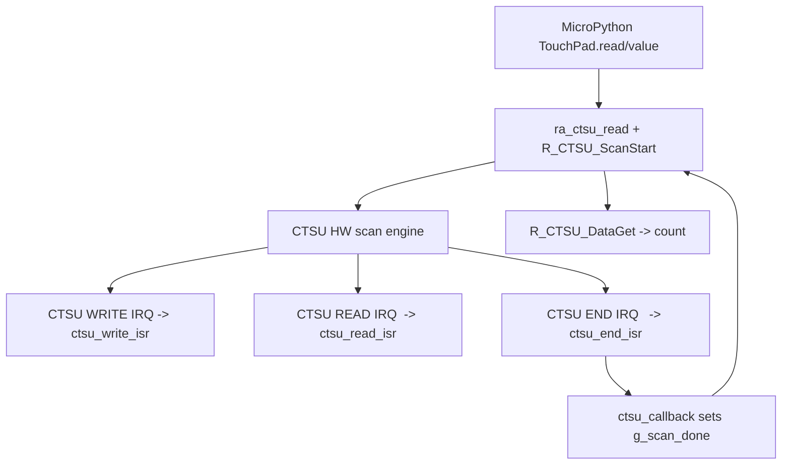

## CTSU (TouchPad) поддръжка за **RA4M2** в MicroPython `renesas-ra` порт – пълен запис на отговорите от чата + анализ

### Chat transcript (какво беше отговорено в чата, без да се губи съдържание)

#### Въпрос 1
**User:** „анализирай в ra4m2 как е реализиран CTSU подръжка , ползва ли се прекъсване?“

#### Отговор 1 (кратък, първи отговор в чата)
CTSU в `ports/renesas-ra` се ползва като backend за `machine.TouchPad` и е реализирана като:
- **MicroPython binding**: `machine_touchpad.c` (вика `ra_ctsu_*`, не вика директно `R_CTSU_*`)
- **HAL wrapper**: `ra/ra_ctsu.c` (обвивка около FSP `r_ctsu`)
- **FSP драйвер**: `lib/fsp/ra/fsp/src/r_ctsu/r_ctsu.c` (реална имплементация + ISR-и)

CTSU кодът се включва в build-а само ако е включен touchpad (`MICROPY_HW_ENABLE_TOUCHPAD=1`).

За RA4M2: **да, използват се прекъсвания** (CTSU WRITE/READ/END). За `VK_RA4M2` те са вързани във векторната таблица (`ra_gen/vector_data.c`). Wrapper-ът изглежда като „polling“, защото синхронно чака флаг, но флагът се вдига от callback, който се извиква от ISR пътя.

(В края на първия отговор беше предложена следваща стъпка за проверка на точните ISR дефиниции в FSP `r_ctsu.c`.)

#### Въпрос 2
**User:** „моля задълбочен анализ без въпроси!“

#### Отговор 2 (задълбочен анализ, пълният текст)

### Реален статус (какво има в репото)
В `ports/renesas-ra` CTSU се използва като backend за `machine.TouchPad` и се компилира/линква **само** ако `MICROPY_HW_ENABLE_TOUCHPAD=1`.

Когато е включено, билдът добавя:

```make
ifeq ($(MICROPY_HW_ENABLE_TOUCHPAD),1)
SRC_C += machine_touchpad.c
HAL_SRC_C += $(HAL_DIR)/ra/fsp/src/r_ctsu/r_ctsu.c
HAL_SRC_C += $(addprefix ra/,ra_ctsu.c)
endif
```

**Извод:** Това не е “пасивна” конфигурация, а реално включен FSP драйвер (`lib/fsp/.../r_ctsu.c`) + локален wrapper (`ra/ra_ctsu.c`) + Python binding (`machine_touchpad.c`).

---

### Слоеве / отговорности (архитектура)
1. **MicroPython binding** – `ports/renesas-ra/machine_touchpad.c`
   - Не вика директно `R_CTSU_*`.
   - Вика само `ra_ctsu_*` (wrapper), който контролира жизнения цикъл и политиката на драйвера.

2. **HAL wrapper** – `ports/renesas-ra/ra/ra_ctsu.c`
   - Подготвя пиновете (TSCAP + TS), попълва `ctsu_cfg_t`, отваря CTSU чрез `R_CTSU_Open()`.
   - Реализира синхронно четене: `ScanStart` + изчакване callback да вдигне флаг + `DataGet`.
   - Съдържа RA4M2-специфични настройки (канали, TSCAP, drive честота).

3. **FSP CTSU драйвер** – `lib/fsp/ra/fsp/src/r_ctsu/r_ctsu.c`
   - Реализира истинската CTSU state machine.
   - Дефинира ISR-и за CTSU WRITE/READ/END.
   - В `Open()` enable-ва IRQ-тата чрез BSP.

4. **Board vector таблица** – напр. `ports/renesas-ra/boards/VK_RA4M2/ra_gen/vector_data.c`
   - Включва CTSU WRITE/READ/END във векторната таблица.
   - Съдържа weak stubs, които се override-ват от “strong” дефинициите на FSP драйвера, когато той е линкнат.

---

### RA4M2-специфични детайли в `ra/ra_ctsu.c`

#### 1) Пинове и активни канали
Wrapper-ът е консервативен: активира само малък набор TS, които са валидни и (предполагаемо) налични/рутирани.

- **TSCAP**: `P207` (`BSP_IO_PORT_02_PIN_07`)
- **Активни TS канали**: `g_ts_channels[] = { 1, 2 }`
- **TS→GPIO mapping**:
  - TS01 → P205
  - TS02 → P206
  - останалите записи са `BSP_IO_PORT_PIN_INVALID`

Причината е описана в коментарите: ако активираш канал в `CHAC`, но пинът е invalid/не-рутиран, CTSU може да генерира overflow/ICOMP и offset tuning да не завърши.

#### 2) CTSU режим на работа
Wrapper-ът задава:
- `cap = CTSU_CAP_SOFTWARE` (software trigger)
- `md  = CTSU_MODE_SELF_MULTI_SCAN` (self-cap)
- `num_rx = CTSU_NUM_CHANNELS`, `num_tx = 0`
- генерира `ctsuchac0..4` от активните TS канали

#### 3) Drive честота (SDPA) за RA4M2
За RA4M2 е зададен `RA_CTSU_SDPA_DEFAULT = 24`, с цел около 0.5 MHz drive, при допусканията в коментара (PCLKB=25 MHz, CTSU_CFG_PCLK_DIVISION=0).

#### 4) Критичен параметър: `num_moving_average`
Wrapper-ът принудително задава `g_ctsu_cfg.num_moving_average = 1`.

Причина (директно от коментара в кода): ако остане 0 (след `memset`), FSP `R_CTSU_DataGet()` може да връща `FSP_ERR_CTSU_INCOMPLETE_TUNING (6002)` безкрайно, защото `average` никога не става >0.

---

### Използва ли CTSU прекъсвания? **Да – задължително**

#### 1) Векторна таблица за VK_RA4M2
В `vector_data.c` CTSU IRQ-тата са добавени:

```c
[20] = ctsu_write_isr,  /* CTSU WRITE */
[21] = ctsu_read_isr,   /* CTSU READ  */
[22] = ctsu_end_isr,    /* CTSU END   */
```

Има weak stubs:

```c
BSP_WEAK_REFERENCE void ctsu_write_isr(void) { }
BSP_WEAK_REFERENCE void ctsu_read_isr(void) { }
BSP_WEAK_REFERENCE void ctsu_end_isr(void) { }
```

Когато `lib/fsp/.../r_ctsu.c` е линкнат, неговите “strong” дефиниции override-ват тези weak stubs.

#### 2) Wrapper-ът подава IRQ номерата към FSP
`ra_ctsu.c` попълва:
- `g_ctsu_cfg.write_irq = VECTOR_NUMBER_CTSU_WRITE`
- `g_ctsu_cfg.read_irq  = VECTOR_NUMBER_CTSU_READ`
- `g_ctsu_cfg.end_irq   = VECTOR_NUMBER_CTSU_END`

#### 3) FSP драйверът enable-ва IRQ-тата в `R_CTSU_Open()`
В `lib/fsp/ra/fsp/src/r_ctsu/r_ctsu.c`:

```c
R_BSP_IrqCfgEnable(p_cfg->write_irq, CTSU_CFG_INT_PRIORITY_LEVEL, p_instance_ctrl);
R_BSP_IrqCfgEnable(p_cfg->read_irq,  CTSU_CFG_INT_PRIORITY_LEVEL, p_instance_ctrl);
R_BSP_IrqCfgEnable(p_cfg->end_irq,   CTSU_CFG_INT_PRIORITY_LEVEL, p_instance_ctrl);
```

`CTSU_CFG_INT_PRIORITY_LEVEL` за VK_RA4M2 е дефиниран в `boards/VK_RA4M2/ra_cfg/fsp_cfg/r_ctsu_cfg.h` като **12**.

---

### Какво правят 3-те CTSU ISR-а (защо без тях не става)

Това е ключово за въпроса “ползва ли се прекъсване”: **не е само “END interrupt”**.

1. **`ctsu_write_isr`** (CTSUWR)
   - Зарежда CTSU регистри/настройки за текущия/следващия елемент.
   - При `CTSU_CFG_DTC_SUPPORT_ENABLE == 0` (тук е 0) работи в CPU.

2. **`ctsu_read_isr`** (CTSURD)
   - Чете `CTSUSC/CTSURC` и записва стойностите в scan buffer.
   - В коментарите на FSP е изрично: RC трябва да се прочете, иначе сканът може да “увисне”.

3. **`ctsu_end_isr`** (CTSUFN)
   - Става при “всички елементи са сканирани”.
   - Маркира state `SCANNED` и извиква user callback (`p_callback`), ако е зададен.

---

### Синхронният API в wrapper-а всъщност е “polling над interrupt-driven скан”

`ra_ctsu_read_simple()` прави:
1) `R_CTSU_ScanStart()`
2) чака `g_scan_done` в bounded loop (~50ms)
3) `R_CTSU_DataGet()`

Флагът `g_scan_done` се вдига в `ctsu_callback()`. А този callback се извиква от FSP **в `ctsu_end_isr`**.

**Извод:** Външно изглежда като polling, но без работещи IRQ/ISR няма да има callback и ще има timeout.

---

### Какво става ако прекъсванията не работят/не са вързани

Очакван симптом в този порт:
- `R_CTSU_ScanStart()` се вика
- `g_scan_done` не става true
- wrapper-ът връща timeout (чака ~50ms)

Това е диагностично силен индикатор за проблем във:
- vector table (`vector_data.c/.h`),
- build-time включване (дали `MICROPY_HW_ENABLE_TOUCHPAD=1` и `r_ctsu.c` е линкнат),
- IRQ enable/priority,
- mapping на `VECTOR_NUMBER_CTSU_*`.

---

### Копируема „картинка“ (Mermaid диаграма)



---

### Конфигурационни файлове (важни за RA4M2)
- Port-level defaults: `ports/renesas-ra/fsp_cfg/r_ctsu_cfg.h`
  - `CTSU_CFG_DTC_SUPPORT_ENABLE` е 0 (т.е. CPU ISR път)
- Board override: `ports/renesas-ra/boards/VK_RA4M2/ra_cfg/fsp_cfg/r_ctsu_cfg.h`
  - `CTSU_CFG_TSCAP_PORT = BSP_IO_PORT_02_PIN_07`
  - `CTSU_CFG_INT_PRIORITY_LEVEL = 12`
  - `CTSU_CFG_DTC_SUPPORT_ENABLE = 0`

---

### Chat transcript (финални искания за MD файл)

#### Въпрос 3
**User:** СЛОЖИ ВСИКИ ОБЯСНЕНИЯ И КАРТИНКАТА В MD FILE

**Assistant:** Съдържанието (обяснения + Mermaid диаграмата) е записано в този MD файл.

#### Въпрос 4
**User:** ВСИЧКО КОЕТО СИ ОТГОВОРИЛ В ЧАТА ГО СЛОЖИ В md ФАЙЛ!

**Assistant:** Файлът беше допълнен с Chat transcript секция и кратък Отговор 1, преди Отговор 2, за да съдържа целия смислов обем от отговорите в чата.

